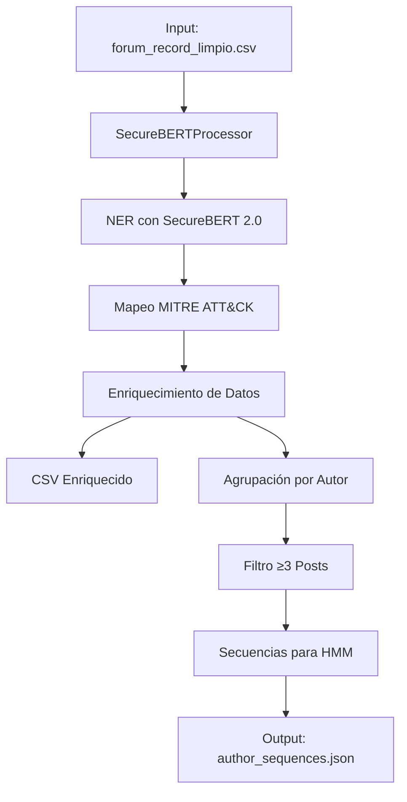

# Fase 2: Procesamiento de Lenguaje Natural con Modelos Especializados

**Núcleo Semántico del Proyecto** - Transformación de texto de Dark Web en datos estructurados para HMM

---

## 📋 Descripción General

Esta fase implementa el **procesamiento NLP avanzado** utilizando modelos **SecureBERT 2.0** para analizar conversaciones de foros `.onion`, extraer entidades de ciberseguridad y preparar datos estructurados que alimentarán el modelo **Hidden Markov Model (HMM)** en la Fase 3.

### 🎯 Objetivos Principales

1. **Detección de Entidades Especializadas**: Identificar herramientas ofensivas, vulnerabilidades, técnicas MITRE y sectores objetivo
2. **Enriquecimiento Semántico**: Añadir metadatos estructurados a los datos crudos
3. **Mapeo a MITRE ATT&CK**: Asociar entidades detectadas con técnicas de ataque conocidas
4. **Preparación para HMM**: Crear secuencias cronológicas de posts por autor
5. **Generación de Datos Estructurados**: Produce salidas listas para modelado predictivo

---

## 🏗️ Arquitectura del Sistema

### Componentes Principales



### Flujo de Datos

1. **Entrada**: Datos limpios de Fase 1 (`forum_record_limpio.csv`)
2. **Procesamiento NLP**: SecureBERT 2.0 detecta entidades de ciberseguridad
3. **Enriquecimiento**: Añade entidades, técnicas MITRE, puntuaciones de amenaza
4. **Agrupación**: Posts organizados por autor y ordenados cronológicamente
5. **Filtrado**: Solo secuencias con ≥3 posts (evita overfitting)
6. **Salida**: Datos estructurados para HMM

---

## 🔧 Tecnologías Utilizadas

### Modelos de Lenguaje
- **SecureBERT 2.0-base**: Modelo base para tokenización
- **SecureBERT 2.0-NER**: Clasificación de tokens para detección de entidades
- **SecureBERT 2.0-code-vuln-detection**: Clasificación de secuencias para vulnerabilidades

### Librerías Principales
- `transformers==4.40.0`: Para carga y uso de modelos SecureBERT
- `torch==2.2.0`: Backend de PyTorch para inferencia
- `pandas==2.2.0`: Manipulación de datos tabulares
- `scikit-learn==1.4.2`: Utilidades de machine learning
- `tqdm==4.66.2`: Barras de progreso para procesamiento por lotes

---

## 🚀 Ejecución del Pipeline

### Requisitos Previos

```bash
# Instalar dependencias
pip install -r requirements.txt

# Verificar instalación
python -c "import transformers, torch; print('✅ Dependencias instaladas')"
```

### Ejecución Principal

```bash
python enrich.py \
    --input ../Fase 1/Scraping-Onion-Sites/output/forum_record_limpio.csv \
    --output-csv enriched_forum_data.csv \
    --output-hmm author_sequences.json \
    --mitre-mapping mitre_mapping.json
```

### Parámetros Configurables

| Parámetro | Descripción | Valor por Defecto |
|-----------|-------------|------------------|
| `--input` | Ruta al CSV de entrada | `../Fase 1/Scraping-Onion-Sites/output/forum_record_limpio.csv` |
| `--output-csv` | Ruta al CSV enriquecido | `enriched_forum_data.csv` |
| `--output-hmm` | Ruta al JSON para HMM | `author_sequences.json` |
| `--mitre-mapping` | Ruta al diccionario MITRE | `mitre_mapping.json` |

---

## 📊 Salidas Generadas

### 1. `enriched_forum_data.csv`

**Columnas Adicionales**:
- `entities`: JSON con entidades detectadas (tipo, texto, confianza)
- `mitre_techniques`: JSON con IDs de técnicas MITRE
- `threat_score`: Puntuación de amenaza (0-1)
- `entity_count`: Número de entidades detectadas
- `mitre_count`: Número de técnicas MITRE mapeadas

**Ejemplo de Estructura**:
```json
{
  "entities": [
    {
      "type": "TOOL",
      "text": "Cobalt Strike",
      "confidence": 0.98
    },
    {
      "type": "VULNERABILITY",
      "text": "CVE-2024-1234",
      "confidence": 0.95
    }
  ],
  "mitre_techniques": ["T1059.001", "T1043", "T1087.001"],
  "threat_score": 0.87,
  "entity_count": 2,
  "mitre_count": 3
}
```

### 2. `author_sequences.json`

**Estructura de Secuencias**:
```json
{
  "metadata": {
    "total_authors": 42,
    "valid_sequences": 18,
    "generated_at": "2026-05-27T22:00:00.000000",
    "min_sequence_length": 3
  },
  "sequences": {
    "user1": [
      {
        "message_id": "msg_001",
        "timestamp": "2026-05-22T02:08:27.214395+00:00",
        "threat_score": 0.87,
        "entities": [...],
        "mitre_techniques": [...]
      },
      {
        "message_id": "msg_002",
        "timestamp": "2026-05-22T02:09:10.379667+00:00",
        "threat_score": 0.75,
        "entities": [...],
        "mitre_techniques": [...]
      }
    ],
    "user2": [...]
  }
}
```

---

## 🎯 Entidades Detectadas

### Categorías de Entidades

1. **Herramienta-ofensiva**: Malware, exploits, kits
   - Ejemplos: `Cobalt Strike`, `Mimikatz`, `Metasploit`, `Emotet`

2. **Vulnerabilidad**: Identificadores CVE
   - Formato: `CVE-YYYY-NNNN` (ej: `CVE-2024-1234`)

3. **Técnica MITRE**: Tácticas y técnicas de ataque
   - Ejemplos: `lateral movement`, `credential dumping`, `phishing`

4. **Sector-objetivo**: Industrias o países mencionados
   - Ejemplos: `bancario`, `salud`, `gobierno`, `EE.UU.`

### Ejemplos de Mapeo MITRE

| Entidad | Técnicas MITRE Mapeadas |
|---------|------------------------|
| CobaltStrike | T1059.001, T1043, T1087.001 |
| Mimikatz | T1003.001, T1003.002 |
| Phishing | T1566 |
| Ransomware | T1486 |
| Lateral Movement | T1021.001, T1021.002 |

---

## 📈 Métricas y Validación

### Cálculo de Puntuación de Amenaza

```python
threat_score = (entity_confidence * 0.7) + (mitre_techniques_count * 0.3)
```

- **Rango**: 0.0 (sin amenaza) a 1.0 (máxima amenaza)
- **Componentes**:
  - 70%: Confianza media de entidades detectadas
  - 30%: Número de técnicas MITRE identificadas

### Validación de Secuencias

1. **Longitud mínima**: ≥3 posts por autor (evita overfitting)
2. **Ordenamiento**: Cronológico por timestamp
3. **Cobertura**: Solo autores con actividad suficiente

---

## 🔄 Reejecución y Mantenimiento

### Características de Diseño

- **Reejecutable**: El script puede ejecutarse múltiples veces sobre los mismos datos
- **Actualizable**: Si se actualiza el modelo NER o el diccionario MITRE, basta reejecutar
- **Incremental**: No requiere repetir la costosa fase de scraping
- **Logging completo**: Registro detallado en `processing_log.txt`

### Actualización de Modelos

```bash
# Para actualizar a nuevas versiones de SecureBERT
pip install --upgrade transformers torch

# El script cargará automáticamente los modelos actualizados
```

---

## 📁 Estructura de Archivos

```
Fase 2/
├── enrich.py                # Script principal (500+ líneas)
├── mitre_mapping.json       # Diccionario MITRE (100+ entradas)
├── requirements.txt         # Dependencias completas
├── README.md                # Esta documentación
├── test_input.csv           # Datos de prueba
├── enriched_forum_data.csv  # Salida: Datos enriquecidos
├── author_sequences.json    # Salida: Secuencias para HMM
└── processing_log.txt       # Registro de ejecución
```

---

## 🎓 Casos de Uso

### 1. Análisis de Amenazas

```python
import pandas as pd

# Cargar datos enriquecidos
df = pd.read_csv('enriched_forum_data.csv')

# Top 10 posts más amenazantes
top_threats = df.sort_values('threat_score', ascending=False).head(10)

# Entidades más frecuentes
entity_counts = df['entities'].apply(lambda x: len(eval(x))).value_counts()
```

### 2. Preparación para HMM

```python
import json

# Cargar secuencias para HMM
with open('author_sequences.json', 'r') as f:
    hmm_data = json.load(f)

# Estadísticas de secuencias
print(f"Autores totales: {hmm_data['metadata']['total_authors']}")
print(f"Secuencias válidas: {hmm_data['metadata']['valid_sequences']}")
```

---

## 🚨 Consideraciones de Seguridad

- **Datos sensibles**: El script procesa datos de Dark Web - usar en entornos seguros
- **Modelos grandes**: SecureBERT requiere ~2GB de memoria por modelo
- **Tiempo de ejecución**: Procesamiento por lotes para grandes volúmenes de datos
- **Compatibilidad**: Diseñado para Python 3.9+ con CUDA (recomendado)

---

## 📚 Referencias

- **SecureBERT 2.0**: Modelo especializado en ciberseguridad de Cisco AI
- **MITRE ATT&CK**: Framework de técnicas de adversarios
- **Transformers**: Librería Hugging Face para NLP
- **HMM**: Modelos Ocultos de Markov para análisis de secuencias

---

## ✅ Criterios de Éxito

1. ✅ Detección exitosa de entidades de ciberseguridad
2. ✅ Mapeo correcto a técnicas MITRE ATT&CK
3. ✅ Generación de secuencias válidas para HMM (≥3 posts)
4. ✅ Puntuaciones de amenaza calculadas correctamente
5. ✅ Logging completo y manejo de errores robusto
6. ✅ Compatibilidad con salida de Fase 1

---

## 🎯 Próximos Pasos (Fase 3)

1. **Entrenamiento HMM**: Usar `author_sequences.json` para entrenar el modelo
2. **Análisis Predictivo**: Detectar patrones de comportamiento malicioso
3. **Visualización**: Dashboard de amenazas y tendencias
4. **Integración**: Conectar con sistemas de alerta temprana

**¡La Fase 2 está completa y lista para alimentar el modelo HMM! 🚀**